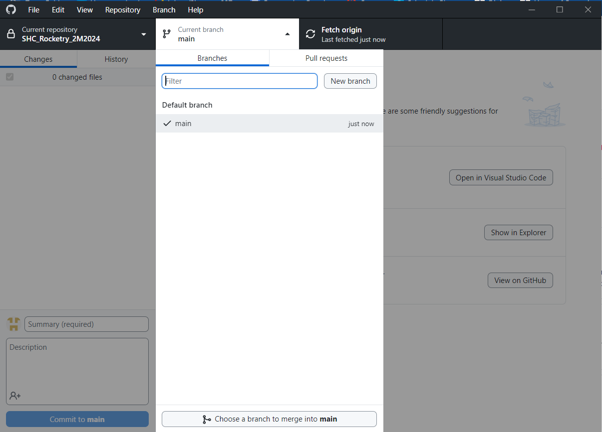

# SHC_Rocketry_2M2024
Repository for all Space Hardware Club Two Month Rocketry Challenge code.

************************************
DO NOT EDIT FILES ON THE MAIN BRANCH
************************************

How To Create A Project
-----------------------
1. Create a new branch, give it the same name as your team
***********************************************************************************************************************

***********************************************************************************************************************
2. Create a new PlatformIO project
# Make sure you choose the Raspberry Pi Pico for the Board
***********************************************************************************************************************

***********************************************************************************************************************
3. Find the project files in your file explorer
***********************************************************************************************************************

***********************************************************************************************************************
4. Open your branch in file explorer
***********************************************************************************************************************

***********************************************************************************************************************
5. Move your project folder to the branch folder
***********************************************************************************************************************

***********************************************************************************************************************
