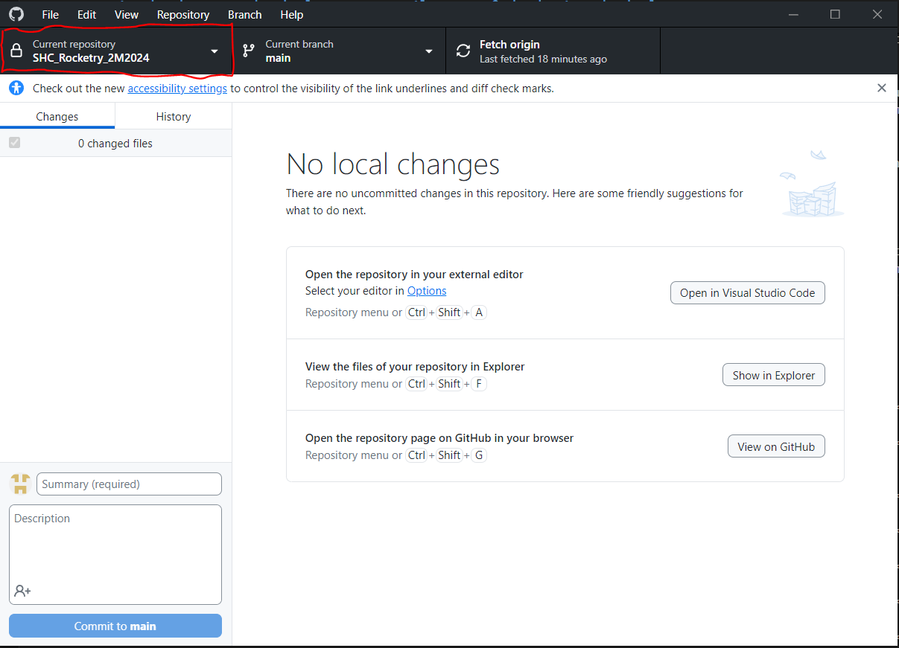

# SHC_Rocketry_2M2024
Repository for all Space Hardware Club Two Month Rocketry Challenge code.

# Designed and Overseen by Charles Marmann Email: cmm0077@uah.edu Discord: Charles_Marmann

*****************************************************
***DO NOT EDIT FILES ON THE MAIN BRANCH***
*****************************************************

## Overview of Software Responsibilities
------------------------------------
As the software team you will be responsible for programming a Raspberry Pi Pico microcontroller to use sensor feedback to control your rocket's air brakes.
In case you are unfamiliar with microcontroller, they are small boards that contain c computer that you will upload a C++ file to. You will use pins on the Pico to send and receive signals from your sensors. Most of the code to use the sensors and microcontrollers can be found in libraries, so most of your time will be spent copying, pasting, and fitting example code together so that your program can accomplish whatever tasks you need it to do.

## Required Programs
-----------------------
### 1. VSCode [Download Here](https://code.visualstudio.com/download).
VSCode will be the main IDE (Integrated development environment). This is where you will write your program and upload it to your Pico.
### 2. Platform IO (Install on VScode) [Instructions Here](https://platformio.org/install/ide?install=vscode).
Platform IO is an extension for VSCode that allows us to work with microcontrollers in VSCode. VSCode alone cannot upload to microcontrollers and doesn't have libraries for the sensors that you will be using.
### 3. Arduino IDE [Download Here](https://www.arduino.cc/en/software).
This is a basic IDE for programming microcontrollers, this program is only good for actively testing code and should not be used until you enter the debugging phase. The reason we use this is it allows us to send commands and receive data from the microcontroller as it is running.
### 4. Github Desktop [Download Here](https://desktop.github.com/download/).
Github desktop is an application that will allow your team to easily work on the same project. The importance of this application will become more apparent once you start working together on your program.

## Joining the Github repository
----------------------------
If you are seeing this file it is safe to assume that you have at least found the Github repository for the Rocketry Two Month 2024 Challenge. Since this repository is private you will need to send me your github username, preferably in your team's software chanel. Once you have access to the repository you will need to open up github desktop.
### 1. In the top left of github desktop you will see a dropdown box labeled current repository.

### 2. After clicking on this you will need to click add

### 3. You will then need to click on clone repository and then select Charles-Marmann/SHC_Rocketry_2M2024

## Since this part can be a little tricky, don't hesitate to ask me for help.

## How To Create A Project
-----------------------
### 1. Create a new branch, give it the same name as your team
***********************************************************************************************************************

***********************************************************************************************************************
### 2. Create a new PlatformIO project
# Make sure you choose the Raspberry Pi Pico for the Board
***********************************************************************************************************************

***********************************************************************************************************************
### 3. Find the project files in your file explorer
***********************************************************************************************************************

***********************************************************************************************************************
### 4. Open your branch in file explorer
***********************************************************************************************************************

***********************************************************************************************************************
### 5. Move your project folder to the branch folder
***********************************************************************************************************************

***********************************************************************************************************************
